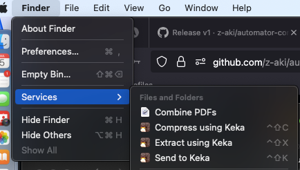
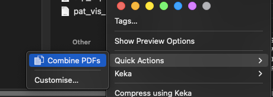

# Automator - Combine Pdfs

Automator (Mac) script to combine several PDFs into one file

Combines together multiple PDF files in the order they are selected, and saves the new file in the directory of the first, with a name chosen by the user.

## support

macOS Ventura onwards are supported.

For macOS Monterey and below, "combine PDFs" action does not work due to python2. They can do the following:

Select all PDFs in Finder > right click > Quick actions > Create PDF. 

## Installation and usage

Download the zip from github.com/z-aki/automator-combine-pdfs/releases/latest, right click the workflow file > open with > "Automator Installer.app" > Confirm installation. The service will be available in `~/Library/Services`. 

To use, select PDF files in Finder > Finder menu in top left > Services > combine PDFs > Enter a unique file name without extension.

